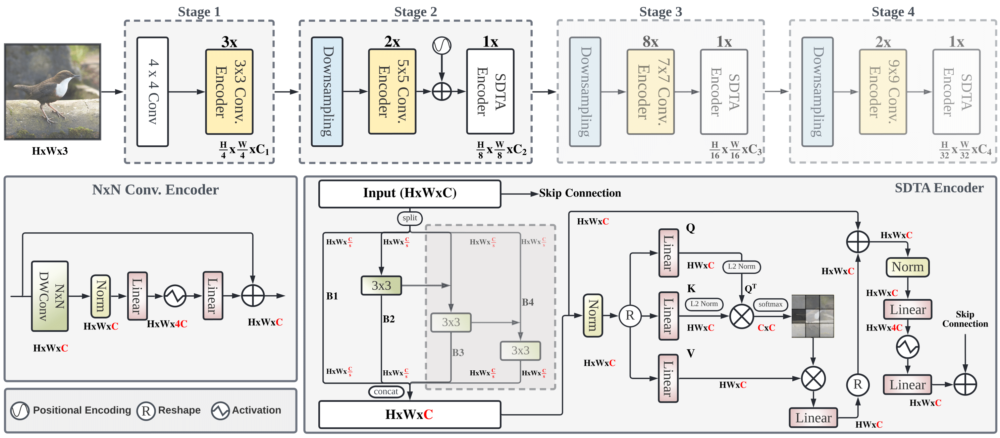

Public Code: [Link](https://www.kaggle.com/code/ausw900/isic-2024-base-edgenext)

# Introduction
The goal of this project is to output the predicted probability of a skin lesion being malignant or benign, given the lesion image and other associated metadata.
I've long been interested in applying machine learning techniques to the medical field, and as soon as I finished learning about CNNs, I got to work on this project.
This dataset came from the Kaggle competition for ISIC 2024: [link](https://www.kaggle.com/competitions/isic-2024-challenge).

# Data Cleaning and Dataset
The main training provided in the Kaggle competition was a folder of jpg images and a csv of metadata associated with each image. To get the data in usable form, I created a class
called ISICData, which uses PyTorch's Dataset as a superclass and defines init, len, and getitem methods for the class. The getitem method takes the csv file as a pandas dataframe and 
opens the image associated with the id in the dataframe. It then applies image transforms and finally returns the image and truth labels. I then put those datasets into DataLoaders. 
In short, it gives me a way to actually use the data for training purposes.

## Image Transforms 
The image transforms I decided to do were horizontal flips, vertical flips, resizing, cropping, and saturation and brightness jittering. I chose these transformations because these were transformations that didn't alter
the image too drastically. In particular, I jitter saturation and brightness only slightly, and did not change other aspects like hue since I figured colors would be an important signal for diagnosis. Finally, I convert
the image to a tensor and normalize the inputs according to EdgeNeXt's pretrained model. This ensures that the EdgeNeXt model gets fed the data it expects for training.

# Base EdgeNeXt Model
Going from a book full of theory to direct application was challenging, so I first looked at the top solutions for inspiration. From the first place solution ([link](https://www.kaggle.com/competitions/isic-2024-challenge/writeups/ilya-novoselskiy-1st-place-solution)),
I read that EdgeNeXt was an effective CNN model for the image data. EdgeNeXt is a CNN model that is relatively lightweight, learns global information well, and has
adaptive kernel sizes which strike a balance between efficiency and learning necessary high-level details. Inspired by ViTs and CNNs, it combines the advantages of both without the large overhead. It was the obvious choice to make, especially given my 30 hour limited
GPU compute time (which would be a problem later on, as I have learned).

I fine-tuned the EdgeNeXt model on an 80-20 train validation split. Here is the architecture as designed from the official repository:

Image Credit: [EdgeNeXt Repo](https://github.com/mmaaz60/EdgeNeXt)

I set the number of output nodes to 1, since I am only predicting between two classes of benign and malignant. This outputs a logit, which I then put through 
a sigmoid function to get a probability between 0 and 1. I set the number of epochs to 12.

# Practical Considerations
When I built this, I expected the actual machine learning portion to be the hardest part, but it turns out that the hardest part was Kaggle's built in GPU limit of 30 hrs/week and 12 hrs per session. At first, I didn't realize how little that was, and I wasted my first 12 hours 
just seeing if my model would work. I got a result back, but it only ran 7 epochs and timed out the 12 hour limit. This was my first larger scale ML project, so I was a bit surprised by this. I had to make checkpointing functionality which would save the best model just in case the 
session timed out in the middle of training. Additionally, I made some efficiency adjustments, the biggest of which was using automatic mixed precision (AMP), which makes certain operations use lower precision floats to save time. This actually resulted in a 2.62x speedup compared to the version that
did not use AMP. My 7 epoch + 5 epoch run checkpointed from the 7th epoch gave me the following results: Train Loss: 0.0053 | Val Loss: 0.0059 | Val pAUC: 0.8578. In terms of the competiton metric, this is 0.14881 out of 0.2.

# Next Steps
I have almost completed the next phase of this project, which is making a two headed fusion model. It starts with an independent image branch using EdgeNeXt and another independent MLP branch using the metadata provided for each image, concatenates the results, and classifies the concatenated tensor 
using another MLP. The only step that remains is fully training, which is taking much longer because I am employing a 5 fold approach to training and making predictions by averaging the outputs of the models across all 5 folds.  

# Citations
[Kaggle Competition](https://www.kaggle.com/competitions/isic-2024-challenge)

[First Place Solution](https://www.kaggle.com/competitions/isic-2024-challenge/writeups/ilya-novoselskiy-1st-place-solution)

[EdgeNeXt Repo](https://github.com/mmaaz60/EdgeNeXt)
